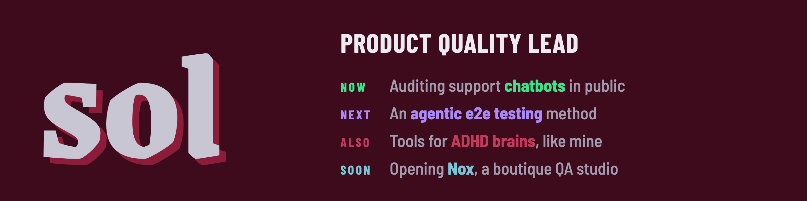

**Now:** [Customer support chatbot observatory](https://github.com/missyeahhh/chatbot-observatory)
Public audits of support bots against versioned rubrics: accessibility, deceptive patterns, operational truthfulness.

**Also:** [ADHD Hyperfocus Graph](https://github.com/missyeahhh/adhd-hyperfocus-graph)
An Obsidian plugin that makes the graph readable for ADHD and dyslexic brains.

[LinkedIn](https://www.linkedin.com/in/soldr)
